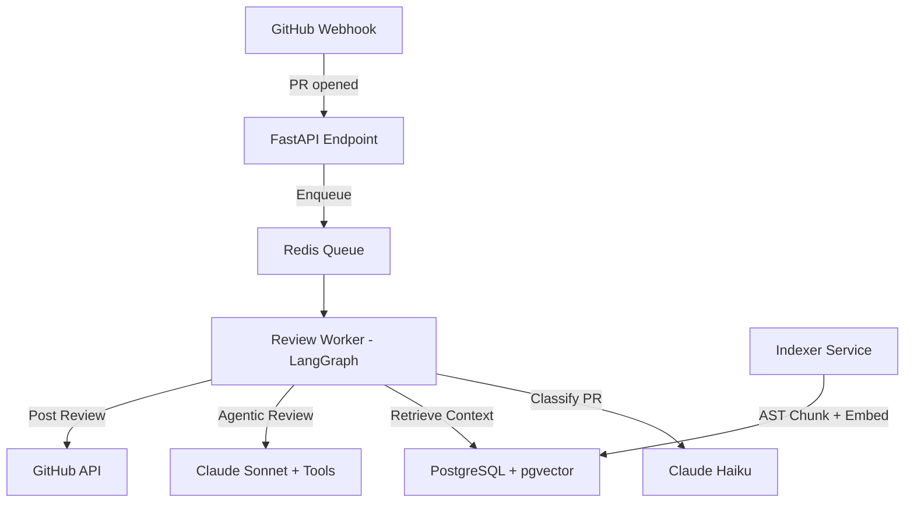

# PR Reviewer Agent

AI-powered code review agent that understands your entire repository, not just the diff.

[](https://github.com/yourusername/pr-reviewer-agent/actions)
[](LICENSE)

## Problem

Code review is the bottleneck of most engineering teams. Existing AI review tools comment on diffs in isolation — they don't understand your project's conventions, architecture, or existing code patterns. This leads to noisy false positives and missed real issues.

## Solution

An agent that **first understands your project** (via RAG over AST-parsed code chunks, README, ADR documents) and then reviews PRs using tools to actively investigate the codebase.

## Architecture



## Key Technical Decisions

| Decision | Why | Alternative Considered | Trade-off |
|---|---|---|---|
| **AST-based chunking** | Functions/classes as first-class units with metadata | Flat text splitter | More complex parser, but 40%+ better retrieval relevance |
| **Hybrid retrieval (semantic + identifier grep)** | Catches both conceptual and exact-name matches | Pure vector search | Extra DB indexes, but eliminates "can't find function by name" failures |
| **LangGraph for agentic loop** | State machine with conditional routing by PR type | Plain while-loop or LangChain Chains | Learning curve, but clean separation of concerns |
| **Claude Sonnet for review** | Best code understanding at reasonable cost | GPT-4o | Slightly higher cost, but better structured output adherence |
| **Anthropic native API (no LangChain wrapper)** | Full control over tool_use, no magic | LangChain ChatAnthropic | More boilerplate, but easier debugging |
| **ARQ over Celery** | Async-native, simpler for single-worker | Celery | Less ecosystem, but no sync/async bridging issues |
| **pgvector over dedicated vector DB** | One less service to operate | Pinecone, Qdrant | Slightly less performant at scale, but simpler infra |

## Features

- **AST-based code chunking** — Python (stdlib `ast`), JS/TS (tree-sitter), Markdown (header-based)
- **Hybrid retrieval** — semantic search + trigram identifier matching + file neighborhood
- **Agentic review** with 7 tools: `search_codebase`, `read_file`, `find_similar_functions`, `find_usages`, `check_test_coverage`, `lookup_past_discussions`, `get_file_diff_context`
- **Conditional routing** — PR classified as bugfix/feature/refactor with risk assessment
- **Cost tracking** — every LLM call logged with tokens, cost, latency
- **Feedback loop** — developer reactions on comments stored for quality tracking
- **SSE streaming** — real-time review progress
- **Dashboard** — stats with Chart.js visualization

## Local Development

### Prerequisites
- Python 3.11+
- Docker & Docker Compose
- GitHub App (or PAT for development)

### Setup

```bash
# Clone
git clone https://github.com/yourusername/pr-reviewer-agent.git
cd pr-reviewer-agent

# Environment
cp .env.example .env
# Edit .env with your API keys

# Start infrastructure
docker-compose up -d postgres redis

# Install dependencies
pip install -e ".[dev]"

# Run migrations
alembic upgrade head

# Start the app
uvicorn app.main:app --reload

# Start the worker (separate terminal)
arq app.workers.tasks.WorkerSettings

# Run tests
pytest tests/ -v
```

### Manual indexing
```bash
python -m scripts.index_repo --repo owner/name --local-path /path/to/repo
```

## Evaluation

```bash
# Build golden dataset
python -m scripts.build_golden_dataset --repo pallets/flask --count 20

# Run evaluation
python -m tests.eval.run_eval --repo pallets/flask --limit 5
```

## Cost

Average cost per PR review (~200 lines):
- Classification (Haiku): ~$0.001
- Embeddings (text-embedding-3-small): ~$0.002
- Agent reasoning (Sonnet, ~3 tool calls): ~$0.08
- Final review (Sonnet): ~$0.03
- **Total: ~$0.11 per PR**

## Limitations

- Large refactor PRs (>500 lines) can exceed context limits
- Non-Python languages have less precise AST chunking
- No UI beyond the minimal dashboard
- Eval pipeline uses LLM-as-judge which has inherent bias

## Future Work

- Fine-tune classifier on user feedback data
- Hierarchical diff summarization for large PRs
- Multi-language tree-sitter support expansion
- Per-repository prompt adaptation from review history
- GitHub Copilot Workspace integration
