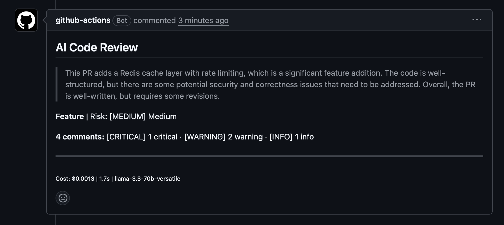
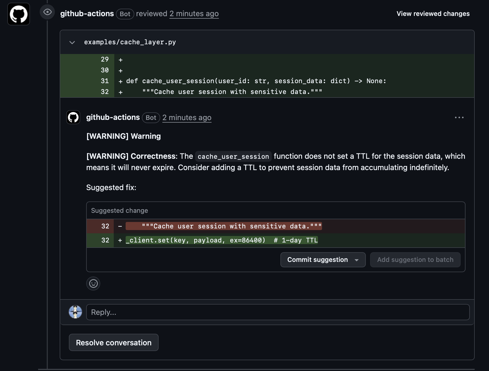
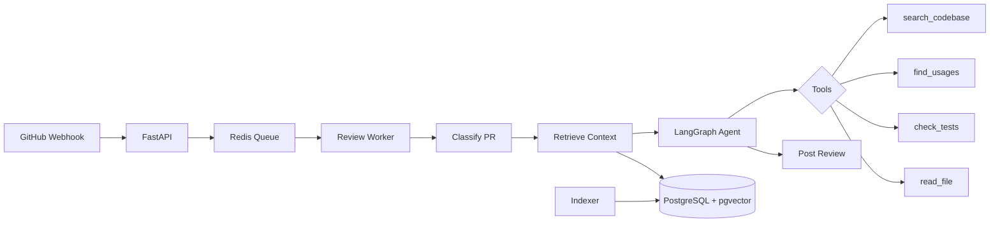

<div align="center">


# AI Code Reviewer

### AI-powered code review for GitHub pull requests.
### One-line setup. Zero config. Works with any LLM.

[](https://github.com/mara-werils/ai-code-reviewer/stargazers)
[](https://github.com/mara-werils/ai-code-reviewer/actions)
[](LICENSE)
[](https://github.com/marketplace/actions/ai-code-reviewer)
[](https://pypi.org/project/pr-reviewer/)
[](https://discord.gg/YOUR_INVITE_LINK)

**Used by [X] developers** &middot; **[Y] reviews completed** &middot; **$0.002/review with Groq**

[Quick Start](#-quick-start) &middot; [GitHub App](#-github-app) &middot; [/fix](#-auto-fix-with-fix) &middot; [Security Scanner](#-security-scanner) &middot; [PR Chat](#-pr-chat--talk-to-the-reviewer) &middot; [/generate-tests](#-ai-test-generation-with-generate-tests) &middot; [Rules Engine](#-review-rules-engine) &middot; [Playground](#-try-it-online-no-install) &middot; [Pre-Commit](#-pre-commit-hook) &middot; [Providers](#-supported-providers) &middot; [/review](#-on-demand-review) &middot; [GitLab](#-gitlab-ci-integration) &middot; [Bitbucket](#-bitbucket-pipelines-integration) &middot; [VS Code](#-vs-code-extension) &middot; [Self-Hosted](#-self-hosted-mode)

</div>

---

<div align="center">

<!-- Replace with actual demo GIF: asciinema or screen recording of a PR getting reviewed -->
<!-- To record: open a PR, wait for review, screen-record the result -->

https://github.com/user-attachments/assets/demo-placeholder

**Open a PR. Get AI review in 30 seconds. Inline comments with suggested fixes.**

</div>

---

## Why teams choose AI Code Reviewer

| | AI Code Reviewer | CodeRabbit | GitHub Copilot | PR-Agent |
|---|---|---|---|---|
| **Pricing** | **Free** (bring your key) | $19/user/mo | $19/user/mo | Free (self-host) |
| **LLM choice** | **Any** (GPT, Claude, Llama, Gemini, Ollama) | Fixed | Fixed | GPT-4 only |
| **GitHub App mode** | **Yes** (1-click install) | Yes | Built-in | No |
| **Setup** | **30 seconds** | 5 minutes | Built-in | 15 minutes |
| **On-demand `/review`** | **Yes** | Yes | No | Yes |
| **Custom instructions** | **Yes** `.pr-reviewer.yml` | Yes | No | Yes |
| **Suggested code blocks** | **Yes** (one-click apply) | Yes | No | Yes |
| **Cost estimation** | **Yes** (pre-review) | No | N/A | No |
| **100% local option** | **Yes** (Ollama) | No | No | No |
| **Multi-language reviews** | **Yes** (9 languages) | Yes | No | No |
| **Auto-fix `/fix`** | **Yes** (commits fixes to PR) | No | No | No |
| **PR Chat `/ask`** | **Yes** (threaded conversations) | No | No | No |
| **AI Test Gen `/generate-tests`** | **Yes** (commits tests to PR) | No | No | No |
| **Rules Engine** | **Yes** (declarative YAML rules) | No | No | No |
| **Security Scanner (SAST)** | **Yes** (built-in, 20+ rules) | No | No | No |
| **Self-learning** | **Yes** (learns from team feedback) | No | No | No |
| **Analytics Dashboard** | **Yes** (web UI, no DB) | No | No | No |
| **Multi-repo impact** | **Yes** (cross-repo warnings) | No | No | No |
| **Web playground** | **Yes** (try without install) | No | No | No |
| **Pre-commit hook** | **Yes** (block before PR) | No | No | No |
| **VS Code extension** | **Yes** | No | Built-in | No |
| **GitLab CI support** | **Yes** (native) | No | No | Yes |
| **Bitbucket Pipelines** | **Yes** (native) | No | No | No |
| **Self-hosted + RAG** | **Yes** (agentic, AST-indexed) | No | No | Yes |
| **Retry with backoff** | **Yes** (all providers) | Unknown | N/A | No |
| **Webhook idempotency** | **Yes** (SHA dedup) | Unknown | N/A | No |
| **Open source** | **MIT** | No | No | Apache-2.0 |

---

## Review summary



## Inline comments with suggested fixes



---

## Quick Start

### 1. Add the workflow (30 seconds)

Create `.github/workflows/ai-review.yml`:

```yaml
name: AI Code Review

on:
  pull_request:
    types: [opened, synchronize, reopened]

permissions:
  contents: read
  pull-requests: write

jobs:
  review:
    runs-on: ubuntu-latest
    steps:
      - uses: actions/checkout@v4
      - uses: mara-werils/ai-code-reviewer@v1
        env:
          OPENAI_API_KEY: ${{ secrets.OPENAI_API_KEY }}
```

### 2. Add your API key

Go to **Settings > Secrets > Actions** and add your API key.

### 3. Open a PR

That's it. AI review lands in 30 seconds.

> **Want the cheapest option?** Use Groq with Llama 3.3 — it's **$0.002/review** with a [free API key](https://console.groq.com).

---

## GitHub App

**Install as a GitHub App instead of a GitHub Action** — no YAML editing, works across all repos, 1-click install.

### Why GitHub App over Action?

| | GitHub App | GitHub Action |
|---|---|---|
| **Setup** | Install → done | Edit YAML per repo |
| **Multi-repo** | One install covers all repos | YAML in each repo |
| **Commands** | All work out of the box | Needs workflow config |
| **Hosting** | Your server (Docker/Fly.io) | GitHub-hosted runners |
| **Cost** | Your server + LLM API | Free runners + LLM API |

### Quick setup (5 minutes)

```bash
# Interactive setup
./scripts/setup-github-app.sh
```

Or manually:

**1. Create a GitHub App** at [github.com/settings/apps/new](https://github.com/settings/apps/new):
- Webhook URL: `https://YOUR_SERVER/webhooks/github`
- Permissions: Contents (R/W), Pull requests (R/W), Issues (R/W), Metadata (R)
- Events: Pull request, Issue comment, PR review comment

**2. Download the private key** and save as `private-key.pem`

**3. Deploy:**

```bash
# Docker (simplest)
export GITHUB_APP_ID=your_app_id
export GITHUB_WEBHOOK_SECRET=your_secret
export GROQ_API_KEY=gsk_...   # or OPENAI_API_KEY, etc.
docker compose -f docker-compose.app.yml up -d

# Fly.io (free tier available)
fly launch --config fly.toml
fly secrets set GITHUB_APP_ID=... GITHUB_WEBHOOK_SECRET=... \
  GITHUB_PRIVATE_KEY="$(cat private-key.pem)" GROQ_API_KEY=...
fly deploy
```

**4. Install the App** on your repos — open a PR, get a review.

### Supported commands

All commands work automatically with the GitHub App:

| Command | What it does |
|---------|-------------|
| _auto_ | Reviews every PR on open/push |
| `/review` | Trigger review on demand |
| `/fix` | Auto-fix review comments |
| `/ask <question>` | Ask a question about the PR |
| `/generate-tests` | Generate tests for changed files |
| _reply to bot_ | Continue conversation in thread |

---

## Auto-Fix with `/fix`

Type **`/fix`** in any PR comment after a review — AI reads the review comments, generates fixes, and commits them directly to your branch.

```
You:  /fix
AI:   👀 Analyzing 3 issues from the review...
AI:   ## AI Code Fix
      Applied 3 fixes across 2 files.

      ### src/db.py
      - Fixed SQL injection by using parameterized query
      - Added input validation for user_id
        Commit: abc1234

      ### src/api.py
      - Added null check before accessing response.data
        Commit: def5678
```

How it works:
1. AI collects all `[CRITICAL]` and `[WARNING]` comments from the last review
2. For each file: reads the current content, generates fixed version via LLM
3. Commits each fix directly to the PR branch
4. Posts a summary of what was fixed and what was skipped

> Requires `contents: write` permission. Add `/fix` support with the [on-demand workflow](examples/on-demand-review.yml).

---

## PR Chat — Talk to the Reviewer

**Two ways to chat with the AI reviewer directly in your PR:**

### 1. Reply to any review comment

When the AI leaves an inline comment, simply **reply to it** — the bot responds in the same thread with full context of the file, diff, and conversation history.

```
AI:     [WARNING] Missing null check — `get_user()` can return None
You:    Why? We validate upstream in the middleware.
AI:     The middleware validates the token format, but doesn't check if the
        user still exists in the database. Between validation and this call,
        the user could be deleted. Add: `if not user: raise HTTPException(404)`
You:    Good point. Can you suggest a fix?
AI:     ```suggestion
        user = get_user(id)
        if user is None:
            raise HTTPException(status_code=404, detail="User not found")
        return user.name
        ```
```

### 2. `/ask` — ask any question about the PR

Type **`/ask <question>`** in any PR comment to ask a question about the changes:

```
You:    /ask What's the impact of this change on the existing API contract?
AI:     This PR changes the `GET /users/{id}` response shape by adding a
        `metadata` field. Existing clients that use strict deserialization
        will need updates. Consider versioning the endpoint or making the
        field optional with a default.
```

### Enable PR Chat

Add `pull_request_review_comment` trigger to your workflow:

```yaml
on:
  pull_request:
    types: [opened, synchronize, reopened]
  issue_comment:
    types: [created]
  pull_request_review_comment:     # <-- enables chat replies
    types: [created]
```

> PR Chat works with all providers. Cost is ~$0.001-0.01 per reply depending on the context size.

---

## AI Test Generation with `/generate-tests`

Type **`/generate-tests`** in any PR comment — AI analyzes your changed code and **generates unit tests, then commits them** directly to your PR branch.

```
You:  /generate-tests
AI:   ## AI Test Generator

      Generated 5 tests across 2 files for 3 source files.

      ### src/validator.py
      Created: tests/unit/test_validator.py

      - test_validate_email_valid_address
      - test_validate_email_missing_at_symbol
      - test_validate_email_empty_string
      Commit: abc1234

      ### src/api/handlers.py
      Updated: tests/unit/api/test_handlers.py

      - test_create_user_returns_201
      - test_create_user_duplicate_returns_409
      Commit: def5678
```

How it works:
1. Identifies testable source files from the PR diff (skips configs, docs, generated files, test files)
2. For each file: reads content + diff, detects test framework, finds existing tests
3. Generates tests via LLM — respects project conventions, adds to existing test files
4. Commits each test file to the PR branch
5. Posts a summary of what was generated

### Supported languages

Python (pytest), TypeScript/JavaScript (Jest/Vitest), Go (testing), Rust, Java (JUnit), Kotlin, Ruby (RSpec), PHP (PHPUnit), C# (xUnit), C/C++ (Google Test), Swift (XCTest).

### Smart conventions

- **Python**: `src/api.py` → `tests/unit/test_api.py`
- **Go**: `pkg/handler.go` → `pkg/handler_test.go`
- **TypeScript**: `src/components/Button.tsx` → `src/__tests__/components/Button.test.ts`
- **Java/Kotlin**: `src/main/java/Service.java` → `src/test/java/ServiceTest.java`
- If tests already exist, new tests are **added** to the existing file

> Requires `contents: write` permission. Works with the same workflow as `/fix` — add `/generate-tests` to the `issue_comment` trigger.

---

## Review Rules Engine

Define **deterministic, team-specific review rules** as code in `.pr-reviewer-rules.yml`. Rules run alongside AI review — no LLM needed, instant, zero cost.

### Quick start

Create `.pr-reviewer-rules.yml` in your repo root:

```yaml
rules:
  # Pattern rule: regex matched against added lines
  - name: no-raw-sql
    pattern: "execute\\(.*SELECT|INSERT|UPDATE|DELETE"
    severity: critical
    message: "Use ORM instead of raw SQL to prevent injection."
    include_files: "src/**/*.py"

  # File-match rule: require tests when API changes
  - name: require-tests-for-api
    when:
      files_match: "src/api/**/*.py"
      no_files_match: "tests/**/test_*.py"
    severity: warning
    message: "API changes should include test coverage."

  # Catch debug statements
  - name: no-debugger
    pattern: "debugger;|pdb\\.set_trace|breakpoint\\(\\)"
    severity: critical
    message: "Remove debugger before merging."

  # Catch hardcoded secrets
  - name: no-hardcoded-secrets
    pattern: "(?:api_key|secret|password|token)\\s*=\\s*[\"'][^\"']{8,}"
    severity: critical
    message: "Use environment variables instead of hardcoded secrets."
```

### Rule types

| Type | Trigger | Use case |
|------|---------|----------|
| **Pattern** | Regex matches an added line in the diff | Catch raw SQL, debug statements, secrets, TODOs |
| **File match** | Files matching a glob are changed, but counter-files are absent | Require tests for API changes, changelog for features |

### Rule options

| Field | Required | Description |
|-------|----------|-------------|
| `name` | Yes | Unique rule identifier |
| `pattern` | For pattern rules | Regex to match against added lines |
| `when.files_match` | For file-match rules | Glob for triggering files |
| `when.no_files_match` | No | Glob for counter-files (rule passes if these exist) |
| `severity` | No | `critical`, `warning`, `suggestion`, `info` (default: `warning`) |
| `message` | No | Comment body when rule triggers |
| `include_files` | No | Only check files matching this glob |
| `exclude_files` | No | Skip files matching this glob |

### How it works

1. Rules are loaded from `.pr-reviewer-rules.yml` at review time
2. Pattern rules scan every added line in the diff against the regex
3. File-match rules check the list of changed files against the glob
4. Violations are posted as inline comments alongside AI review comments
5. No LLM calls needed — rules are instant and free

> See [examples/pr-reviewer-rules.yml](examples/pr-reviewer-rules.yml) for a comprehensive example with 12 ready-to-use rules.

---

## Security Scanner

**Built-in SAST** that runs on every PR — catches vulnerabilities before they reach production. **Zero LLM cost**, instant, deterministic.

### What it detects

| Category | Examples | Severity |
|----------|----------|----------|
| **SQL Injection** | f-strings in `execute()`, `fmt.Sprintf` in Go queries | Critical |
| **XSS** | `innerHTML`, `dangerouslySetInnerHTML`, `mark_safe()` | High |
| **Hardcoded Secrets** | API keys, passwords, AWS creds, private keys | Critical |
| **Command Injection** | `os.system()`, `eval()`, `shell=True` | Critical |
| **Path Traversal** | File operations with user input | High |
| **SSRF** | HTTP requests with user-controlled URLs | High |
| **Insecure Crypto** | MD5/SHA1 for security, `Math.random()` for tokens | Medium |
| **Insecure Deserialization** | `pickle.loads()`, `yaml.load()` without SafeLoader | Critical/High |
| **Auth Issues** | CORS wildcard, JWT without verification, debug mode | Medium/High |
| **Go-specific** | `InsecureSkipVerify`, SQL with `fmt.Sprintf` | Critical/High |

### How it works

- Runs automatically alongside AI review (no extra config)
- Scans only added/modified lines in the diff
- Language-aware: Go rules only fire on `.go` files, etc.
- Skips test files for rules like debug statements and `Math.random()`
- Findings appear as inline comments + a summary in the review body
- Controlled by `check_security: true` in `.pr-reviewer.yml` (enabled by default)

### 20+ built-in rules

All rules are pattern-based (regex) and cover **OWASP Top 10** vulnerabilities across Python, JavaScript/TypeScript, Go, Java, Ruby, PHP, and more.

> The security scanner is **free** — no LLM calls needed. It runs in milliseconds alongside your AI review.

---

## Try It Online (No Install)

Paste any public GitHub PR URL and get an AI review instantly:

```bash
# Self-host the playground
git clone https://github.com/mara-werils/ai-code-reviewer.git
cd ai-code-reviewer
pip install . uvicorn starlette
export GROQ_API_KEY=gsk_...
export GITHUB_TOKEN=ghp_...
uvicorn playground.app:app --port 8000

# Or with Docker
docker build -t pr-reviewer-playground playground/
docker run -p 8000:8000 -e GROQ_API_KEY=gsk_... -e GITHUB_TOKEN=ghp_... pr-reviewer-playground
```

Open http://localhost:8000 — paste a PR URL, get a review. Share the link with your team.

---

## Pre-Commit Hook

Review code before every commit. Catches issues before they reach the PR.

```yaml
# .pre-commit-config.yaml
repos:
  - repo: https://github.com/mara-werils/ai-code-reviewer
    rev: v0.4.0
    hooks:
      - id: ai-code-review
```

```bash
# Install and run
pip install pre-commit
pre-commit install

# Now every git commit runs AI review on staged changes
git commit -m "feat: add new endpoint"
# AI Code Review: scanning 3 files (42 lines changed)...
# CRITICAL src/api.py:15
#   SQL injection vulnerability: user input passed directly to query
# Commit blocked: 1 issue(s) at or above threshold.
```

### Configuration

| Env Variable | Default | Description |
|---|---|---|
| `PROVIDER` | auto-detect | LLM provider |
| `SEVERITY_THRESHOLD` | `critical` | Block on: critical, warning, suggestion |
| `MAX_COMMENTS` | `10` | Max review comments |
| `REVIEW_STYLE` | `concise` | Review depth |

> Set `SEVERITY_THRESHOLD=warning` to also block on warnings. Use `--no-verify` to skip in a hurry.

---

## On-Demand Review

Type **`/review`** in any PR comment to trigger a review on demand.

```yaml
# Add to your workflow to enable /review command
on:
  pull_request:
    types: [opened, synchronize, reopened]
  issue_comment:
    types: [created]

jobs:
  auto-review:
    if: github.event_name == 'pull_request'
    runs-on: ubuntu-latest
    steps:
      - uses: actions/checkout@v4
      - uses: mara-werils/ai-code-reviewer@v1
        env:
          OPENAI_API_KEY: ${{ secrets.OPENAI_API_KEY }}

  on-demand:
    if: >
      github.event_name == 'issue_comment' &&
      github.event.issue.pull_request &&
      startsWith(github.event.comment.body, '/review')
    runs-on: ubuntu-latest
    steps:
      - name: React to comment
        uses: actions/github-script@v7
        with:
          script: |
            await github.rest.reactions.createForIssueComment({
              owner: context.repo.owner,
              repo: context.repo.repo,
              comment_id: context.payload.comment.id,
              content: 'eyes'
            });
      - name: Get PR ref
        id: pr
        uses: actions/github-script@v7
        with:
          script: |
            const pr = await github.rest.pulls.get({
              owner: context.repo.owner,
              repo: context.repo.repo,
              pull_number: context.issue.number
            });
            core.setOutput('head_ref', pr.data.head.ref);
      - uses: actions/checkout@v4
        with:
          ref: ${{ steps.pr.outputs.head_ref }}
      - uses: mara-werils/ai-code-reviewer@v1
        env:
          OPENAI_API_KEY: ${{ secrets.OPENAI_API_KEY }}
```

See the full example: [`examples/on-demand-review.yml`](examples/on-demand-review.yml)

---

## Supported Providers

Use **any LLM**. Switch providers with one line.

| Provider | Model | Cost/review* | Setup |
|---|---|---|---|
| **Groq** | Llama 3.3 70B | ~**$0.002** | `GROQ_API_KEY` ([free tier](https://console.groq.com)) |
| **Google** | Gemini 2.0 Flash | ~$0.003 | `GOOGLE_API_KEY` |
| **OpenAI** | GPT-4o | ~$0.05 | `OPENAI_API_KEY` |
| **Anthropic** | Claude Sonnet | ~$0.08 | `ANTHROPIC_API_KEY` |
| **Ollama** | Any local model | **$0.00** | [Setup guide](#ollama-local) |
| **Azure OpenAI** | GPT-4o | ~$0.05 | `AZURE_OPENAI_API_KEY` + `API_BASE_URL` |
| **Any OpenAI-compatible** | Any | Varies | `OPENAI_API_KEY` + `API_BASE_URL` |

*Estimated for a ~200 line PR.

### Provider examples

<details>
<summary><b>Groq (Llama 3.3 — nearly free, recommended to start)</b></summary>

```yaml
- uses: mara-werils/ai-code-reviewer@v1
  with:
    provider: 'groq'
  env:
    GROQ_API_KEY: ${{ secrets.GROQ_API_KEY }}
```

Get a free API key at [console.groq.com](https://console.groq.com).
</details>

<details>
<summary><b>OpenAI (GPT-4o)</b></summary>

```yaml
- uses: mara-werils/ai-code-reviewer@v1
  env:
    OPENAI_API_KEY: ${{ secrets.OPENAI_API_KEY }}
```
</details>

<details>
<summary><b>Anthropic (Claude)</b></summary>

```yaml
- uses: mara-werils/ai-code-reviewer@v1
  with:
    provider: 'anthropic'
  env:
    ANTHROPIC_API_KEY: ${{ secrets.ANTHROPIC_API_KEY }}
```
</details>

<details>
<summary><b>Google (Gemini)</b></summary>

```yaml
- uses: mara-werils/ai-code-reviewer@v1
  with:
    provider: 'google'
  env:
    GOOGLE_API_KEY: ${{ secrets.GOOGLE_API_KEY }}
```
</details>

<details>
<summary><b id="ollama-local">Ollama (100% local, free)</b></summary>

```yaml
- uses: mara-werils/ai-code-reviewer@v1
  with:
    provider: 'ollama'
    model: 'llama3.1:8b'
    api_base_url: 'http://your-server:11434/v1'
```
</details>

<details>
<summary><b>Any OpenAI-compatible API (LiteLLM, vLLM, etc.)</b></summary>

```yaml
- uses: mara-werils/ai-code-reviewer@v1
  with:
    api_base_url: 'https://your-api.example.com/v1'
    model: 'your-model'
  env:
    OPENAI_API_KEY: ${{ secrets.YOUR_API_KEY }}
```
</details>

---

## GitLab CI Integration

Works with GitLab merge requests via the CLI. Add to your `.gitlab-ci.yml`:

```yaml
ai-code-review:
  stage: test
  image: python:3.11-slim
  rules:
    - if: $CI_PIPELINE_SOURCE == "merge_request_event"
  script:
    - pip install --quiet pr-reviewer
    - pr-reviewer review
        --platform gitlab
        --repo "$CI_PROJECT_PATH"
        --mr "$CI_MERGE_REQUEST_IID"
        --post
  allow_failure: true
```

**Required CI/CD variables:** `GITLAB_TOKEN` (api scope) + your LLM API key (`OPENAI_API_KEY`, `GROQ_API_KEY`, etc.)

> Works with self-hosted GitLab too — set `GITLAB_URL` to your instance URL.

See the full template: [`examples/gitlab-ci.yml`](examples/gitlab-ci.yml)

---

## Bitbucket Pipelines Integration

Works with Bitbucket Cloud pull requests via the CLI. Add to your `bitbucket-pipelines.yml`:

```yaml
image: python:3.11-slim

pipelines:
  pull-requests:
    '**':
      - step:
          name: AI Code Review
          script:
            - pip install pr-reviewer
            - pr-reviewer review
                --platform bitbucket
                --repo $BITBUCKET_WORKSPACE/$BITBUCKET_REPO_SLUG
                --pr $BITBUCKET_PR_ID
                --bb-username $BITBUCKET_USERNAME
                --bb-app-password $BITBUCKET_APP_PASSWORD
                --post
```

**Required repository variables:**
- `BITBUCKET_USERNAME` — your Bitbucket username
- `BITBUCKET_APP_PASSWORD` — [create here](https://bitbucket.org/account/settings/app-passwords/) (needs Repositories: read, Pull requests: write)
- Your LLM API key (`GROQ_API_KEY`, `OPENAI_API_KEY`, etc.)

See the full template: [`examples/bitbucket-pipelines.yml`](examples/bitbucket-pipelines.yml)

---

## Configuration

### Action inputs

```yaml
- uses: mara-werils/ai-code-reviewer@v1
  with:
    # LLM provider (openai, anthropic, groq, google, ollama)
    provider: 'openai'

    # Specific model (auto-selected per provider if empty)
    model: ''

    # Review style: concise, thorough, minimal
    review_style: 'concise'

    # Max comments per review (1-50)
    max_comments: '15'

    # Review comment language (en, zh, ja, ko, es, de, fr, ru, pt)
    language: 'en'

    # Custom instructions for your team
    custom_instructions: |
      - We use the Repository pattern
      - Flag any direct SQL queries in controllers
      - We handle PII — security is critical

    # Auto-label PRs (bugfix, feature, refactor, etc.)
    label_pr: 'false'

    # Suggest missing tests
    suggest_tests: 'true'
```

### Per-repo config (`.pr-reviewer.yml`)

Drop this in your repo root for persistent config:

```yaml
# .pr-reviewer.yml
review_style: thorough
max_comments: 20

custom_instructions: |
  - Our API uses FastAPI with Pydantic v2
  - All new endpoints must have OpenAPI docs
  - We're migrating from callbacks to async/await

ignore_paths:
  - "*.lock"
  - "generated/**"
  - "__snapshots__/**"

ignore_titles:
  - "WIP"
  - "DO NOT MERGE"
```

---

## CLI

Review PRs locally or in any CI:

```bash
pip install pr-reviewer

# Review a GitHub PR
export GITHUB_TOKEN=ghp_...
export OPENAI_API_KEY=sk-...
pr-reviewer review --repo owner/name --pr 42

# Review with a specific provider
pr-reviewer review --repo owner/name --pr 42 --provider groq

# Review a local diff
git diff main..HEAD > changes.diff
pr-reviewer review --diff changes.diff

# Review and post back to GitHub
pr-reviewer review --repo owner/name --pr 42 --post
```

---

## VS Code Extension

Review code directly in your editor — no PR needed.

```
Cmd+Shift+R  →  Review current file
Cmd+Shift+D  →  Review uncommitted changes
Right-click  →  Review selection
```

### Install

Search **"AI Code Reviewer"** in the VS Code Extensions marketplace, or:

```bash
cd vscode-extension
npm install && npm run compile
# Then: Cmd+Shift+P → "Developer: Install Extension from Location..." → select vscode-extension/
```

### Configure

Open Settings → search "AI Code Reviewer":
- **Provider**: openai, anthropic, groq, google, ollama
- **API Key**: your key (or use env vars)
- **Review Style**: concise, thorough, minimal

Issues appear in the **Problems panel** with severity levels (Error, Warning, Info, Hint).

> Works with the same providers as the GitHub Action. $0.002/review with Groq, $0.00 with Ollama.

See the full docs: [`vscode-extension/README.md`](vscode-extension/README.md)

---

## Self-Hosted Mode

For teams needing full control, RAG-powered codebase understanding, and persistent analytics.

```bash
git clone https://github.com/mara-werils/ai-code-reviewer.git
cd ai-code-reviewer
cp .env.example .env  # Edit with your keys
docker-compose up -d
```

### What you get

| Feature | Description |
|---|---|
| **Agentic review** | LangGraph agent with 7 tools to investigate the codebase |
| **AST-based indexing** | Understands functions, classes, imports (Python AST + Tree-sitter for JS/TS/Go) |
| **Hybrid retrieval** | Semantic vector search + identifier matching + file neighborhood + RRF fusion |
| **Cost tracking** | Per-repository budgets and analytics dashboard |
| **Feedback loop** | Learns from developer reactions to comments |
| **SSE streaming** | Real-time review progress |
| **Webhook idempotency** | SHA-based deduplication prevents duplicate reviews |
| **Retry + backoff** | Handles rate limits, timeouts, and transient failures automatically |

### Architecture



---

## FAQ

<details>
<summary><b>Is it free?</b></summary>

The tool itself is 100% free and open source (MIT). You pay only for LLM API calls. With Groq's free tier or Ollama, the total cost is $0.
</details>

<details>
<summary><b>Is my code sent to third parties?</b></summary>

Your code is sent to whichever LLM provider you choose. If you need full privacy, use Ollama with a local model — nothing leaves your network.
</details>

<details>
<summary><b>Does it work with private repos?</b></summary>

Yes. The GitHub Action uses your repository's built-in `GITHUB_TOKEN`, which has access to private repos.
</details>

<details>
<summary><b>Can I use it with GitLab / Bitbucket?</b></summary>

**Both are fully supported!** Use the CLI with `--platform gitlab` or `--platform bitbucket`. See [GitLab CI Integration](#gitlab-ci-integration) and [Bitbucket Pipelines Integration](#bitbucket-pipelines-integration).
</details>

<details>
<summary><b>How do I avoid noisy reviews?</b></summary>

1. Use `review_style: minimal` for less verbose reviews
2. Set `severity_threshold: warning` to skip info-level comments
3. Add `custom_instructions` to teach it your team's conventions
4. Use `ignore_paths` to skip generated files
</details>

<details>
<summary><b>Can I review in Chinese / Japanese / Korean / Spanish?</b></summary>

Yes! Set `language: 'zh'` (or `ja`, `ko`, `es`, `de`, `fr`, `ru`, `pt`).
</details>

<details>
<summary><b>How is this different from PR-Agent?</b></summary>

- **Multi-LLM**: Works with any LLM, not just GPT-4. Switch with one line.
- **Simpler setup**: One workflow file, no config needed.
- **Cheaper**: Groq at $0.002/review vs GPT-4 at ~$0.10/review.
- **Cost estimation**: Know the cost before running a review.
- **Better reliability**: Retry with exponential backoff, webhook idempotency.
</details>

---

## Badge

Show that your project uses AI code reviews:

```markdown
[](https://github.com/mara-werils/ai-code-reviewer)
```

[](https://github.com/mara-werils/ai-code-reviewer)

---

## Roadmap

- [x] Multi-LLM support (GPT, Claude, Llama, Gemini, Ollama)
- [x] Inline comments with suggested fixes
- [x] On-demand `/review` command
- [x] Self-hosted mode with RAG
- [x] CLI tool
- [x] Cost estimation
- [x] GitLab integration
- [x] Bitbucket integration — native Bitbucket Cloud API + Pipelines support
- [x] PR chat — ask questions, reply to review comments, `/ask` command
- [x] Auto-fix `/fix` — AI commits fixes directly to your PR branch
- [x] Learning from feedback — self-calibrating reviews based on team reactions
- [x] VS Code extension
- [ ] JetBrains plugin
- [ ] Slack/Discord notifications

---

## Contributing

Contributions are welcome! See [CONTRIBUTING.md](CONTRIBUTING.md) for guidelines.

```bash
git clone https://github.com/mara-werils/ai-code-reviewer.git
cd ai-code-reviewer
pip install -e ".[dev]"
pytest tests/ -v
ruff check .
```

---

## License

MIT — use it however you want.

---

<div align="center">

**If this saves you time, [give it a star](https://github.com/mara-werils/ai-code-reviewer). It helps others find the project.**

[Report Bug](https://github.com/mara-werils/ai-code-reviewer/issues) &middot; [Request Feature](https://github.com/mara-werils/ai-code-reviewer/issues) &middot; [Discord](https://discord.gg/YOUR_INVITE_LINK) &middot; [Discussions](https://github.com/mara-werils/ai-code-reviewer/discussions)

</div>
