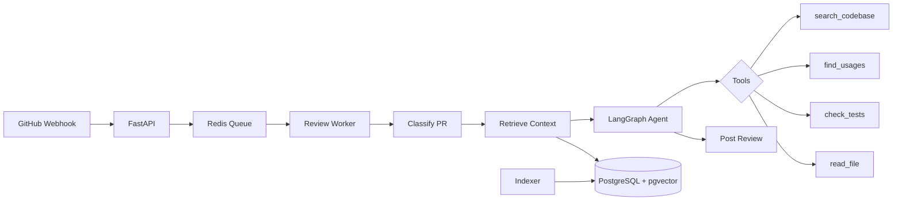

<div align="center">

# AI Code Reviewer

**AI-powered code review for GitHub pull requests.**
**One-line setup. Zero config. Works with any LLM.**

[](https://github.com/mara-werils/ai-code-reviewer/actions)
[](LICENSE)
[](https://github.com/mara-werils/ai-code-reviewer/stargazers)

[Quick Start](#quick-start) · [Examples](#examples) · [Providers](#supported-providers) · [Configuration](#configuration) · [Self-Hosted](#self-hosted-mode) · [FAQ](#faq)

</div>

---

<!-- DEMO GIF: Replace with actual recording -->
<!--  -->

> Open a PR → get an AI code review in 30 seconds. Inline comments with severity levels, security checks, and actionable suggestions.

## Why another code review tool?

| | AI Code Reviewer | CodeRabbit | GitHub Copilot | PR-Agent |
|---|---|---|---|---|
| **Pricing** | **Free** (bring your key) | $19/user/mo | $19/user/mo | Free (self-host) |
| **LLM Choice** | **Any** (GPT, Claude, Llama, Gemini, Ollama) | Fixed | Fixed | GPT-4 only |
| **Setup time** | **30 seconds** | 5 minutes | Built-in | 15 minutes |
| **Custom instructions** | Yes `.pr-reviewer.yml` | Yes | No | Yes |
| **Self-hosted** | Yes | No | No | Yes |
| **100% local option** | Yes (Ollama) | No | No | No |
| **Multi-language reviews** | Yes, 9 languages | Yes | No | No |
| **Open source** | Yes, MIT | No | No | Yes, Apache-2.0 |

## Quick Start

### 1. Add the workflow (30 seconds)

Create `.github/workflows/ai-review.yml`:

```yaml
name: AI Code Review

on:
  pull_request:
    types: [opened, synchronize, reopened]

permissions:
  contents: read
  pull-requests: write

jobs:
  review:
    runs-on: ubuntu-latest
    steps:
      - uses: actions/checkout@v4
      - uses: mara-werils/ai-code-reviewer@v1
        env:
          OPENAI_API_KEY: ${{ secrets.OPENAI_API_KEY }}
```

### 2. Add your API key

Go to **Settings → Secrets → Actions** and add `OPENAI_API_KEY`.

### 3. Open a PR

That's it. The reviewer will comment on your PR automatically.

---

## Supported Providers

Use any LLM. Switch providers with one line.

| Provider | Model | Cost per review* | Setup |
|---|---|---|---|
| **OpenAI** | GPT-4o | ~$0.05 | `OPENAI_API_KEY` |
| **Anthropic** | Claude Sonnet | ~$0.08 | `ANTHROPIC_API_KEY` |
| **Groq** | Llama 3.3 70B | ~**$0.002** | `GROQ_API_KEY` ([free tier](https://console.groq.com)) |
| **Google** | Gemini 2.0 Flash | ~$0.003 | `GOOGLE_API_KEY` |
| **Ollama** | Any local model | **$0.00** | [Setup guide](#ollama-local) |
| **Azure OpenAI** | GPT-4o | ~$0.05 | `AZURE_OPENAI_API_KEY` + `API_BASE_URL` |
| **Any OpenAI-compatible** | Any | Varies | `OPENAI_API_KEY` + `API_BASE_URL` |

*Estimated for a ~200 line PR.

### Provider examples

<details>
<summary><b>OpenAI (GPT-4o)</b></summary>

```yaml
- uses: mara-werils/ai-code-reviewer@v1
  env:
    OPENAI_API_KEY: ${{ secrets.OPENAI_API_KEY }}
```
</details>

<details>
<summary><b>Anthropic (Claude)</b></summary>

```yaml
- uses: mara-werils/ai-code-reviewer@v1
  with:
    provider: 'anthropic'
  env:
    ANTHROPIC_API_KEY: ${{ secrets.ANTHROPIC_API_KEY }}
```
</details>

<details>
<summary><b>Groq (Llama — nearly free)</b></summary>

```yaml
- uses: mara-werils/ai-code-reviewer@v1
  with:
    provider: 'groq'
  env:
    GROQ_API_KEY: ${{ secrets.GROQ_API_KEY }}
```

Get a free API key at [console.groq.com](https://console.groq.com).
</details>

<details>
<summary><b>Google (Gemini)</b></summary>

```yaml
- uses: mara-werils/ai-code-reviewer@v1
  with:
    provider: 'google'
  env:
    GOOGLE_API_KEY: ${{ secrets.GOOGLE_API_KEY }}
```
</details>

<details>
<summary><b id="ollama-local">Ollama (100% local, free)</b></summary>

```yaml
- uses: mara-werils/ai-code-reviewer@v1
  with:
    provider: 'ollama'
    model: 'llama3.1:8b'
    api_base_url: 'http://your-server:11434/v1'
```
</details>

<details>
<summary><b>Any OpenAI-compatible API (LiteLLM, vLLM, etc.)</b></summary>

```yaml
- uses: mara-werils/ai-code-reviewer@v1
  with:
    api_base_url: 'https://your-api.example.com/v1'
    model: 'your-model'
  env:
    OPENAI_API_KEY: ${{ secrets.YOUR_API_KEY }}
```
</details>

---

## Examples

### What the review looks like

The reviewer posts a summary comment + inline comments on specific lines:

**Summary:**
> ## AI Code Review
>
> This PR adds JWT authentication middleware. The implementation is clean but has a potential token validation bypass in the refresh flow.
>
> **Feature** | Risk: [MEDIUM] Medium
>
> **3 comments:** [CRITICAL] 1 critical · [WARNING] 1 warning · [SUGGESTION] 1 suggestion

**Inline comment:**
> **[CRITICAL] Critical**
>
> The JWT secret is loaded from environment at import time. If the env var is missing, this silently defaults to an empty string, making all tokens valid.
>
> ```suggestion
> JWT_SECRET = os.environ["JWT_SECRET"]  # Fail fast if missing
> ```

---

## Configuration

### Action inputs

```yaml
- uses: mara-werils/ai-code-reviewer@v1
  with:
    # LLM provider (openai, anthropic, groq, google, ollama)
    provider: 'openai'

    # Specific model (auto-selected if empty)
    model: ''

    # Review style: concise, thorough, minimal
    review_style: 'concise'

    # Max comments per review
    max_comments: '15'

    # Review comment language (en, zh, ja, ko, es, de, fr, ru, pt)
    language: 'en'

    # Custom instructions for your team
    custom_instructions: |
      - We use the Repository pattern
      - Flag any direct SQL queries in controllers
      - We handle PII — security is critical

    # Auto-label PRs (bugfix, feature, refactor, etc.)
    label_pr: 'false'

    # Suggest missing tests
    suggest_tests: 'true'
```

### Per-repo config (`.pr-reviewer.yml`)

Drop this in your repo root for persistent config:

```yaml
# .pr-reviewer.yml
review_style: thorough
max_comments: 20

custom_instructions: |
  - Our API uses FastAPI with Pydantic v2
  - All new endpoints must have OpenAPI docs
  - We're migrating from callbacks to async/await

ignore_paths:
  - "*.lock"
  - "generated/**"
  - "__snapshots__/**"

ignore_titles:
  - "WIP"
  - "DO NOT MERGE"
```

---

## CLI

Review PRs locally or in any CI:

```bash
pip install pr-reviewer

# Review a GitHub PR
export GITHUB_TOKEN=ghp_...
export OPENAI_API_KEY=sk-...
pr-reviewer review --repo owner/name --pr 42

# Review with a specific provider
pr-reviewer review --repo owner/name --pr 42 --provider groq

# Review a local diff
git diff main..HEAD > changes.diff
pr-reviewer review --diff changes.diff

# Review and post back to GitHub
pr-reviewer review --repo owner/name --pr 42 --post
```

---

## Self-Hosted Mode

For teams needing full control, RAG-powered codebase understanding, and persistent analytics.

```bash
git clone https://github.com/mara-werils/ai-code-reviewer.git
cd ai-code-reviewer
cp .env.example .env  # Edit with your keys
docker-compose up -d
```

Self-hosted includes:
- **AST-based code indexing** — understands functions, classes, imports
- **Hybrid retrieval** — semantic search + identifier matching
- **Agentic review** — LangGraph agent with tools to investigate the codebase
- **Analytics dashboard** — cost tracking, precision metrics, tool usage
- **Feedback loop** — learns from developer reactions
- **SSE streaming** — real-time review progress

### Architecture



---

## FAQ

<details>
<summary><b>Is it free?</b></summary>

The tool itself is 100% free and open source. You pay only for LLM API calls. With Groq's free tier or Ollama, the total cost is $0.
</details>

<details>
<summary><b>Is my code sent to third parties?</b></summary>

Your code is sent to whichever LLM provider you choose (OpenAI, Anthropic, etc.). If you need full privacy, use Ollama with a local model — nothing leaves your network.
</details>

<details>
<summary><b>Does it work with private repos?</b></summary>

Yes. The GitHub Action uses your repository's built-in `GITHUB_TOKEN`, which has access to private repos.
</details>

<details>
<summary><b>Can I use it with GitLab / Bitbucket?</b></summary>

Not yet. GitHub is supported first. GitLab and Bitbucket support is on the roadmap.
</details>

<details>
<summary><b>How do I avoid noisy reviews?</b></summary>

1. Use `review_style: minimal` for less verbose reviews
2. Set `severity_threshold: warning` to skip info-level comments
3. Add `custom_instructions` to teach it your team's conventions
4. Use `ignore_paths` to skip generated files
</details>

<details>
<summary><b>Can I review in Chinese / Japanese / Korean / Spanish?</b></summary>

Yes! Set `language: 'zh'` (or `ja`, `ko`, `es`, `de`, `fr`, `ru`, `pt`).
</details>

---

## Roadmap

- [ ] GitLab integration
- [ ] Bitbucket integration
- [ ] PR chat — ask questions about the PR
- [ ] Auto-fix — apply suggested changes automatically
- [ ] Learning from feedback — improve reviews based on resolved/dismissed comments
- [ ] IDE extension (VS Code, JetBrains)
- [ ] Slack/Discord notifications

---

## Contributing

Contributions are welcome! See [CONTRIBUTING.md](CONTRIBUTING.md) for guidelines.

```bash
# Development setup
git clone https://github.com/mara-werils/ai-code-reviewer.git
cd ai-code-reviewer
pip install -e ".[dev]"
pytest tests/ -v
ruff check .
```

---

## License

MIT — use it however you want.

---

<div align="center">

**If this saves you time, consider starring the repo.**

[Report Bug](https://github.com/mara-werils/ai-code-reviewer/issues) · [Request Feature](https://github.com/mara-werils/ai-code-reviewer/issues) · [Discussions](https://github.com/mara-werils/ai-code-reviewer/discussions)

</div>
