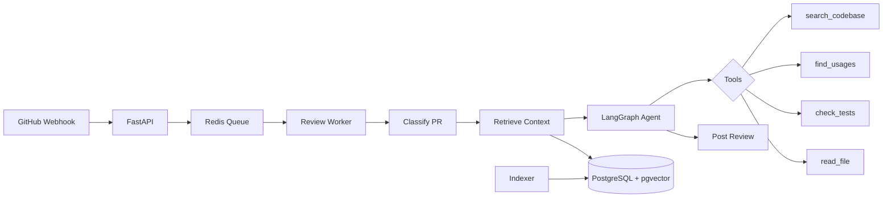

<div align="center">


# AI Code Reviewer

### AI-powered code review for GitHub pull requests.
### One-line setup. Zero config. Works with any LLM.

[](https://github.com/mara-werils/ai-code-reviewer/stargazers)
[](https://github.com/mara-werils/ai-code-reviewer/actions)
[](LICENSE)
[](https://github.com/marketplace/actions/ai-code-reviewer)
[](https://pypi.org/project/pr-reviewer/)

**Used by [X] developers** &middot; **[Y] reviews completed** &middot; **$0.002/review with Groq**

[Quick Start](#-quick-start) &middot; [Providers](#-supported-providers) &middot; [/review Command](#-on-demand-review) &middot; [Config](#-configuration) &middot; [Self-Hosted](#-self-hosted-mode) &middot; [CLI](#-cli)

</div>

---

<div align="center">

<!-- Replace with actual demo GIF: asciinema or screen recording of a PR getting reviewed -->
<!-- To record: open a PR, wait for review, screen-record the result -->

https://github.com/user-attachments/assets/demo-placeholder

**Open a PR. Get AI review in 30 seconds. Inline comments with suggested fixes.**

</div>

---

## Why teams choose AI Code Reviewer

| | AI Code Reviewer | CodeRabbit | GitHub Copilot | PR-Agent |
|---|---|---|---|---|
| **Pricing** | **Free** (bring your key) | $19/user/mo | $19/user/mo | Free (self-host) |
| **LLM choice** | **Any** (GPT, Claude, Llama, Gemini, Ollama) | Fixed | Fixed | GPT-4 only |
| **Setup** | **30 seconds** | 5 minutes | Built-in | 15 minutes |
| **On-demand `/review`** | **Yes** | Yes | No | Yes |
| **Custom instructions** | **Yes** `.pr-reviewer.yml` | Yes | No | Yes |
| **Suggested code blocks** | **Yes** (one-click apply) | Yes | No | Yes |
| **Cost estimation** | **Yes** (pre-review) | No | N/A | No |
| **100% local option** | **Yes** (Ollama) | No | No | No |
| **Multi-language reviews** | **Yes** (9 languages) | Yes | No | No |
| **Self-hosted + RAG** | **Yes** (agentic, AST-indexed) | No | No | Yes |
| **Retry with backoff** | **Yes** (all providers) | Unknown | N/A | No |
| **Webhook idempotency** | **Yes** (SHA dedup) | Unknown | N/A | No |
| **Open source** | **MIT** | No | No | Apache-2.0 |

---

## Review summary


## Inline comments with suggested fixes


---

## Quick Start

### 1. Add the workflow (30 seconds)

Create `.github/workflows/ai-review.yml`:

```yaml
name: AI Code Review

on:
  pull_request:
    types: [opened, synchronize, reopened]

permissions:
  contents: read
  pull-requests: write

jobs:
  review:
    runs-on: ubuntu-latest
    steps:
      - uses: actions/checkout@v4
      - uses: mara-werils/ai-code-reviewer@v1
        env:
          OPENAI_API_KEY: ${{ secrets.OPENAI_API_KEY }}
```

### 2. Add your API key

Go to **Settings > Secrets > Actions** and add your API key.

### 3. Open a PR

That's it. AI review lands in 30 seconds.

> **Want the cheapest option?** Use Groq with Llama 3.3 — it's **$0.002/review** with a [free API key](https://console.groq.com).

---

## On-Demand Review

Type **`/review`** in any PR comment to trigger a review on demand.

```yaml
# Add to your workflow to enable /review command
on:
  pull_request:
    types: [opened, synchronize, reopened]
  issue_comment:
    types: [created]

jobs:
  auto-review:
    if: github.event_name == 'pull_request'
    runs-on: ubuntu-latest
    steps:
      - uses: actions/checkout@v4
      - uses: mara-werils/ai-code-reviewer@v1
        env:
          OPENAI_API_KEY: ${{ secrets.OPENAI_API_KEY }}

  on-demand:
    if: >
      github.event_name == 'issue_comment' &&
      github.event.issue.pull_request &&
      startsWith(github.event.comment.body, '/review')
    runs-on: ubuntu-latest
    steps:
      - name: React to comment
        uses: actions/github-script@v7
        with:
          script: |
            await github.rest.reactions.createForIssueComment({
              owner: context.repo.owner,
              repo: context.repo.repo,
              comment_id: context.payload.comment.id,
              content: 'eyes'
            });
      - name: Get PR ref
        id: pr
        uses: actions/github-script@v7
        with:
          script: |
            const pr = await github.rest.pulls.get({
              owner: context.repo.owner,
              repo: context.repo.repo,
              pull_number: context.issue.number
            });
            core.setOutput('head_ref', pr.data.head.ref);
      - uses: actions/checkout@v4
        with:
          ref: ${{ steps.pr.outputs.head_ref }}
      - uses: mara-werils/ai-code-reviewer@v1
        env:
          OPENAI_API_KEY: ${{ secrets.OPENAI_API_KEY }}
```

See the full example: [`examples/on-demand-review.yml`](examples/on-demand-review.yml)

---

## Supported Providers

Use **any LLM**. Switch providers with one line.

| Provider | Model | Cost/review* | Setup |
|---|---|---|---|
| **Groq** | Llama 3.3 70B | ~**$0.002** | `GROQ_API_KEY` ([free tier](https://console.groq.com)) |
| **Google** | Gemini 2.0 Flash | ~$0.003 | `GOOGLE_API_KEY` |
| **OpenAI** | GPT-4o | ~$0.05 | `OPENAI_API_KEY` |
| **Anthropic** | Claude Sonnet | ~$0.08 | `ANTHROPIC_API_KEY` |
| **Ollama** | Any local model | **$0.00** | [Setup guide](#ollama-local) |
| **Azure OpenAI** | GPT-4o | ~$0.05 | `AZURE_OPENAI_API_KEY` + `API_BASE_URL` |
| **Any OpenAI-compatible** | Any | Varies | `OPENAI_API_KEY` + `API_BASE_URL` |

*Estimated for a ~200 line PR.

### Provider examples

<details>
<summary><b>Groq (Llama 3.3 — nearly free, recommended to start)</b></summary>

```yaml
- uses: mara-werils/ai-code-reviewer@v1
  with:
    provider: 'groq'
  env:
    GROQ_API_KEY: ${{ secrets.GROQ_API_KEY }}
```

Get a free API key at [console.groq.com](https://console.groq.com).
</details>

<details>
<summary><b>OpenAI (GPT-4o)</b></summary>

```yaml
- uses: mara-werils/ai-code-reviewer@v1
  env:
    OPENAI_API_KEY: ${{ secrets.OPENAI_API_KEY }}
```
</details>

<details>
<summary><b>Anthropic (Claude)</b></summary>

```yaml
- uses: mara-werils/ai-code-reviewer@v1
  with:
    provider: 'anthropic'
  env:
    ANTHROPIC_API_KEY: ${{ secrets.ANTHROPIC_API_KEY }}
```
</details>

<details>
<summary><b>Google (Gemini)</b></summary>

```yaml
- uses: mara-werils/ai-code-reviewer@v1
  with:
    provider: 'google'
  env:
    GOOGLE_API_KEY: ${{ secrets.GOOGLE_API_KEY }}
```
</details>

<details>
<summary><b id="ollama-local">Ollama (100% local, free)</b></summary>

```yaml
- uses: mara-werils/ai-code-reviewer@v1
  with:
    provider: 'ollama'
    model: 'llama3.1:8b'
    api_base_url: 'http://your-server:11434/v1'
```
</details>

<details>
<summary><b>Any OpenAI-compatible API (LiteLLM, vLLM, etc.)</b></summary>

```yaml
- uses: mara-werils/ai-code-reviewer@v1
  with:
    api_base_url: 'https://your-api.example.com/v1'
    model: 'your-model'
  env:
    OPENAI_API_KEY: ${{ secrets.YOUR_API_KEY }}
```
</details>

---

## Configuration

### Action inputs

```yaml
- uses: mara-werils/ai-code-reviewer@v1
  with:
    # LLM provider (openai, anthropic, groq, google, ollama)
    provider: 'openai'

    # Specific model (auto-selected per provider if empty)
    model: ''

    # Review style: concise, thorough, minimal
    review_style: 'concise'

    # Max comments per review (1-50)
    max_comments: '15'

    # Review comment language (en, zh, ja, ko, es, de, fr, ru, pt)
    language: 'en'

    # Custom instructions for your team
    custom_instructions: |
      - We use the Repository pattern
      - Flag any direct SQL queries in controllers
      - We handle PII — security is critical

    # Auto-label PRs (bugfix, feature, refactor, etc.)
    label_pr: 'false'

    # Suggest missing tests
    suggest_tests: 'true'
```

### Per-repo config (`.pr-reviewer.yml`)

Drop this in your repo root for persistent config:

```yaml
# .pr-reviewer.yml
review_style: thorough
max_comments: 20

custom_instructions: |
  - Our API uses FastAPI with Pydantic v2
  - All new endpoints must have OpenAPI docs
  - We're migrating from callbacks to async/await

ignore_paths:
  - "*.lock"
  - "generated/**"
  - "__snapshots__/**"

ignore_titles:
  - "WIP"
  - "DO NOT MERGE"
```

---

## CLI

Review PRs locally or in any CI:

```bash
pip install pr-reviewer

# Review a GitHub PR
export GITHUB_TOKEN=ghp_...
export OPENAI_API_KEY=sk-...
pr-reviewer review --repo owner/name --pr 42

# Review with a specific provider
pr-reviewer review --repo owner/name --pr 42 --provider groq

# Review a local diff
git diff main..HEAD > changes.diff
pr-reviewer review --diff changes.diff

# Review and post back to GitHub
pr-reviewer review --repo owner/name --pr 42 --post
```

---

## Self-Hosted Mode

For teams needing full control, RAG-powered codebase understanding, and persistent analytics.

```bash
git clone https://github.com/mara-werils/ai-code-reviewer.git
cd ai-code-reviewer
cp .env.example .env  # Edit with your keys
docker-compose up -d
```

### What you get

| Feature | Description |
|---|---|
| **Agentic review** | LangGraph agent with 7 tools to investigate the codebase |
| **AST-based indexing** | Understands functions, classes, imports (Python AST + Tree-sitter for JS/TS/Go) |
| **Hybrid retrieval** | Semantic vector search + identifier matching + file neighborhood + RRF fusion |
| **Cost tracking** | Per-repository budgets and analytics dashboard |
| **Feedback loop** | Learns from developer reactions to comments |
| **SSE streaming** | Real-time review progress |
| **Webhook idempotency** | SHA-based deduplication prevents duplicate reviews |
| **Retry + backoff** | Handles rate limits, timeouts, and transient failures automatically |

### Architecture



---

## FAQ

<details>
<summary><b>Is it free?</b></summary>

The tool itself is 100% free and open source (MIT). You pay only for LLM API calls. With Groq's free tier or Ollama, the total cost is $0.
</details>

<details>
<summary><b>Is my code sent to third parties?</b></summary>

Your code is sent to whichever LLM provider you choose. If you need full privacy, use Ollama with a local model — nothing leaves your network.
</details>

<details>
<summary><b>Does it work with private repos?</b></summary>

Yes. The GitHub Action uses your repository's built-in `GITHUB_TOKEN`, which has access to private repos.
</details>

<details>
<summary><b>Can I use it with GitLab / Bitbucket?</b></summary>

Not yet. GitHub is supported first. GitLab and Bitbucket support is on the roadmap.
</details>

<details>
<summary><b>How do I avoid noisy reviews?</b></summary>

1. Use `review_style: minimal` for less verbose reviews
2. Set `severity_threshold: warning` to skip info-level comments
3. Add `custom_instructions` to teach it your team's conventions
4. Use `ignore_paths` to skip generated files
</details>

<details>
<summary><b>Can I review in Chinese / Japanese / Korean / Spanish?</b></summary>

Yes! Set `language: 'zh'` (or `ja`, `ko`, `es`, `de`, `fr`, `ru`, `pt`).
</details>

<details>
<summary><b>How is this different from PR-Agent?</b></summary>

- **Multi-LLM**: Works with any LLM, not just GPT-4. Switch with one line.
- **Simpler setup**: One workflow file, no config needed.
- **Cheaper**: Groq at $0.002/review vs GPT-4 at ~$0.10/review.
- **Cost estimation**: Know the cost before running a review.
- **Better reliability**: Retry with exponential backoff, webhook idempotency.
</details>

---

## Badge

Show that your project uses AI code reviews:

```markdown
[](https://github.com/mara-werils/ai-code-reviewer)
```

[](https://github.com/mara-werils/ai-code-reviewer)

---

## Roadmap

- [x] Multi-LLM support (GPT, Claude, Llama, Gemini, Ollama)
- [x] Inline comments with suggested fixes
- [x] On-demand `/review` command
- [x] Self-hosted mode with RAG
- [x] CLI tool
- [x] Cost estimation
- [ ] GitLab integration
- [ ] Bitbucket integration
- [ ] PR chat — ask questions about the PR
- [ ] Auto-fix — apply suggested changes automatically
- [ ] Learning from feedback
- [ ] IDE extension (VS Code, JetBrains)
- [ ] Slack/Discord notifications

---

## Contributing

Contributions are welcome! See [CONTRIBUTING.md](CONTRIBUTING.md) for guidelines.

```bash
git clone https://github.com/mara-werils/ai-code-reviewer.git
cd ai-code-reviewer
pip install -e ".[dev]"
pytest tests/ -v
ruff check .
```

---

## License

MIT — use it however you want.

---

<div align="center">

**If this saves you time, [give it a star](https://github.com/mara-werils/ai-code-reviewer). It helps others find the project.**

[Report Bug](https://github.com/mara-werils/ai-code-reviewer/issues) &middot; [Request Feature](https://github.com/mara-werils/ai-code-reviewer/issues) &middot; [Discussions](https://github.com/mara-werils/ai-code-reviewer/discussions)

</div>
